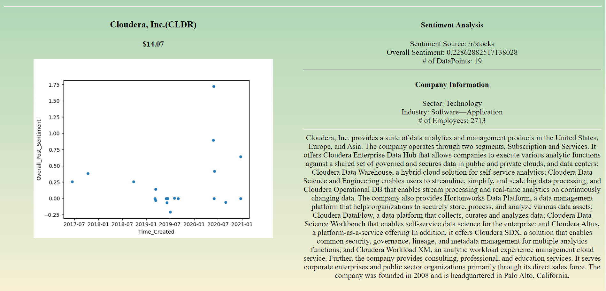

This is a data analytics tool that scrapes data from reddit and displays sentiment analysis data
about a given stock ticker in addition to other useful information gathered from the Yahoo Finance API in a small Flask Webapp.

